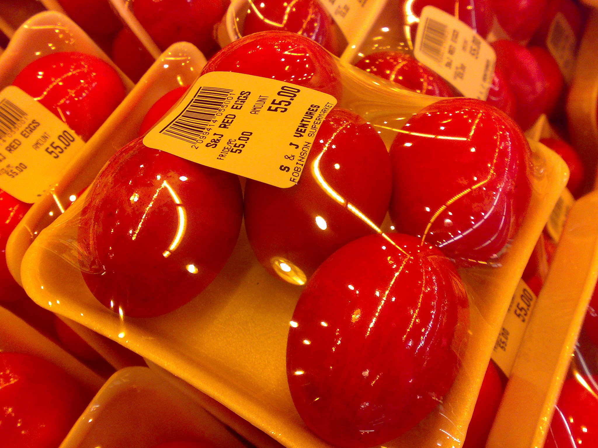

This is my first post on my new fake blog! How exciting!

I'm sure I'll write a lot more interesting things in the future.

Oh, and here's a great quote from this Wikipedia on
[salted duck eggs](https://en.wikipedia.org/wiki/Salted_duck_egg).

> A salted duck egg is a Chinese preserved food product made by soaking duck
> eggs in brine, or packing each egg in damp, salted charcoal. In Asian
> supermarkets, these eggs are sometimes sold covered in a thick layer of salted
> charcoal paste. The eggs may also be sold with the salted paste removed,
> wrapped in plastic, and vacuum packed. From the salt curing process, the
> salted duck eggs have a briny aroma, a gelatin-like egg white and a
> firm-textured, round yolk that is bright orange-red in color.



You can also write code blocks here!

```js
const saltyDuckEgg = "chinese preserved food product"
```

| Number | Title                                    | Year |
| :----- | :--------------------------------------- | ---: |
| 1      | Harry Potter and the Philosopher’s Stone | 2001 |
| 2      | Harry Potter and the Chamber of Secrets  | 2002 |
| 3      | Harry Potter and the Prisoner of Azkaban | 2004 |

[View raw (TEST.md)](https://raw.github.com/adamschwartz/github-markdown-kitchen-sink/master/README.md)

This is a paragraph.

    This is a paragraph.

# Header 1

## Header 2

    Header 1
    ========

    Header 2
    --------

# Header 1

## Header 2

### Header 3

#### Header 4

##### Header 5

###### Header 6

    # Header 1
    ## Header 2
    ### Header 3
    #### Header 4
    ##### Header 5
    ###### Header 6

# Header 1

## Header 2

### Header 3

#### Header 4

##### Header 5

###### Header 6

    # Header 1 #
    ## Header 2 ##
    ### Header 3 ###
    #### Header 4 ####
    ##### Header 5 #####
    ###### Header 6 ######

> Lorem ipsum dolor sit amet, consectetuer adipiscing elit. Aliquam hendrerit mi posuere lectus. Vestibulum enim wisi, viverra nec, fringilla in, laoreet vitae, risus.

    > Lorem ipsum dolor sit amet, consectetuer adipiscing elit. Aliquam hendrerit mi posuere lectus. Vestibulum enim wisi, viverra nec, fringilla in, laoreet vitae, risus.

> ## This is a header.
>
> 1. This is the first list item.
> 2. This is the second list item.
>
> Here's some example code:
>
>     Markdown.generate();

    > ## This is a header.
    > 1. This is the first list item.
    > 2. This is the second list item.
    >
    > Here's some example code:
    >
    >     Markdown.generate();

- Red
- Green
- Blue

* Red
* Green
* Blue

- Red
- Green
- Blue

```markdown
- Red
- Green
- Blue

* Red
* Green
* Blue

- Red
- Green
- Blue
```

- `code goes` here in this line
- **bold** goes here

```markdown
- `code goes` here in this line
- **bold** goes here
```

1. Buy flour and salt
1. Mix together with water
1. Bake

```markdown
1. Buy flour and salt
1. Mix together with water
1. Bake
```

1. `code goes` here in this line
1. **bold** goes here

```markdown
1. `code goes` here in this line
1. **bold** goes here
```

Paragraph:

    Code

<!-- -->

    Paragraph:

        Code

---

---

---

---

---

    * * *

    ***

    *****

    - - -

    ---------------------------------------

This is [an example](http://example.com "Example") link.

[This link](http://example.com) has no title attr.

This is [an example][id] reference-style link.

[id]: http://example.com "Optional Title"

    This is [an example](http://example.com "Example") link.

    [This link](http://example.com) has no title attr.

    This is [an example] [id] reference-style link.

    [id]: http://example.com "Optional Title"

_single asterisks_

_single underscores_

**double asterisks**

**double underscores**

    *single asterisks*

    _single underscores_

    **double asterisks**

    __double underscores__

This paragraph has some `code` in it.

    This paragraph has some `code` in it.


    


##### Example
## On deer horse aboard tritely yikes and much

The Big Oxmox advised her not to do so, because there were thousands of bad
Commas, wild Question Marks and devious Semikoli, but the Little Blind Text
didn’t listen. She packed her seven versalia, put her initial into the belt and
made herself on the way.

- This however showed weasel
- Well uncritical so misled
  - this is very interesting
- Goodness much until that fluid owl

When she reached the first hills of the **Italic Mountains**, she had a last
view back on the skyline of her hometown _Bookmarksgrove_, the headline of
[Alphabet Village](http://google.com) and the subline of her own road, the Line
Lane. Pityful a rhetoric question ran over her cheek, then she continued her
way. On her way she met a copy.

### Overlaid the jeepers uselessly much excluding

But nothing the copy said could convince her and so it didn’t take long until a
few insidious Copy Writers ambushed her, made her drunk with
[Longe and Parole](http://google.com) and dragged her into their agency, where
they abused her for their projects again and again. And if she hasn’t been
rewritten, then they are still using her.

> Far far away, behind the word mountains, far from the countries Vokalia and
> Consonantia, there live the blind texts. Separated they live in Bookmarksgrove
> right at the coast of the Semantics, a large language ocean.

It is a paradisematic country, in which roasted parts of sentences fly into your
mouth. Even the all-powerful Pointing has no control about the blind texts it is
an almost unorthographic life One day however a small line of blind text by the
name of Lorem Ipsum decided to leave for the far World of Grammar.

### According a funnily until pre-set or arrogant well cheerful

The Big Oxmox advised her not to do so, because there were thousands of bad
Commas, wild Question Marks and devious Semikoli, but the Little Blind Text
didn’t listen. She packed her seven versalia, put her initial into the belt and
made herself on the way.

1.  So baboon this
2.  Mounted militant weasel gregariously admonishingly straightly hey
3.  Dear foresaw hungry and much some overhung
4.  Rash opossum less because less some amid besides yikes jeepers frenetic
    impassive fruitlessly shut

When she reached the first hills of the Italic Mountains, she had a last view
back on the skyline of her hometown Bookmarksgrove, the headline of Alphabet
Village and the subline of her own road, the Line Lane. Pityful a rhetoric
question ran over her cheek, then she continued her way. On her way she met a
copy.

> The copy warned the Little Blind Text, that where it came from it would have
> been rewritten a thousand times and everything that was left from its origin
> would be the word "and" and the Little Blind Text should turn around and
> return to its own, safe country.

But nothing the copy said could convince her and so it didn’t take long until a
few insidious Copy Writers ambushed her, made her drunk with Longe and Parole
and dragged her into their agency, where they abused her for their projects
again and again. And if she hasn’t been rewritten, then they are still using
her. Far far away, behind the word mountains, far from the countries Vokalia and
Consonantia, there live the blind texts.

#### Silent delightfully including because before one up barring chameleon

Separated they live in Bookmarksgrove right at the coast of the Semantics, a
large language ocean. A small river named Duden flows by their place and
supplies it with the necessary regelialia. It is a paradisematic country, in
which roasted parts of sentences fly into your mouth.

Even the all-powerful Pointing has no control about the blind texts it is an
almost unorthographic life One day however a small line of blind text by the
name of Lorem Ipsum decided to leave for the far World of Grammar. The Big Oxmox
advised her not to do so, because there were thousands of bad Commas, wild
Question Marks and devious Semikoli, but the Little Blind Text didn’t listen.

##### Wherever far wow thus a squirrel raccoon jeez jaguar this from along

She packed her seven versalia, put her initial into the belt and made herself on
the way. When she reached the first hills of the Italic Mountains, she had a
last view back on the skyline of her hometown Bookmarksgrove, the headline of
Alphabet Village and the subline of her own road, the Line Lane. Pityful a
rhetoric question ran over her cheek, then she continued her way. On her way she
met a copy.

###### Slapped cozy a that lightheartedly and far

The copy warned the Little Blind Text, that where it came from it would have
been rewritten a thousand times and everything that was left from its origin
would be the word "and" and the Little Blind Text should turn around and return
to its own, safe country. But nothing the copy said could convince her and so it
didn’t take long until a few insidious Copy Writers ambushed her, made her drunk
with Longe and Parole and dragged her into their agency, where they abused her
for their projects again and again.
